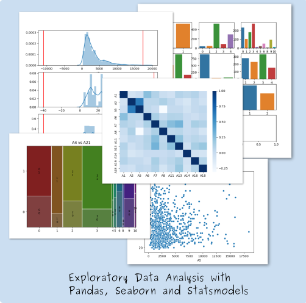

# Academy-Course-DAT31048

**Exploratory Data Analysis using Pandas, Seaborn and Statsmodels**

This course is a CrashProgram (short course) introducing exploratory data analysis using credit risk data as the use case

## Course objectives

* We learn the concept and techniques of Exploratory Data Analysis
* Touch upon the issue of bias and how to mitigate it
* Learn about more advanced formats such as HDF
* Learn basic exploratory data analysis using pandas
* Create standard graphs using seaborn
* Calculate Contingency tables, WoE and Information Value using pandas, scipy and statsmodels

The course is live at the [Open Risk Academy](https://www.openriskacademy.com), this repository
hosts the python scripts used in the course. The scripts can be used standalone but documentation 
is minimal

## Brief Description 

* Step 1: Importing data using pandas
* Step 2: Blindfoldind data and saving in HDF format to preserve metadata
* Step 3: Univariate statistics for numerical and categorical variables
* Step 4: Histograms and Barplots using Seaborn
* Step 5: Identifying outliers visually and numerically
* Step 6: Scatterplots, correlations and correlations heatmaps
* Step 7: Contingency tables and mosaic plots
* Step 8: Assessing association using Chi-Square tests and Information Value

<h4>Course Level and Type:</h4>
<table summary="Course classification table" class="table-factsheet" cellspacing="5" cellpadding="5" border="1"
       align="left">
    <tbody>
    <tr>
        <td></td>
        <td><b>Introductory Level</b></td>
        <td><b>Core Level</b></td>
        <td><b>Advanced Level</b></td>
    </tr>
    <tr>
        <td><b>Non-Technical</b></td>
        <td></td>
        <td></td>
        <td></td>
    </tr>
    <tr>
        <td><b>Technical</b></td>
        <td bgcolor="#EC9126">CrashProgram DAT31048</td>
        <td></td>
        <td></td>
    </tr>
    </tbody>
</table>

#### Where To Get Help:

If you get stuck on any issue with the course or the Academy:

- If the issue is related to the course topics / material, check in the first instance the Course Forum (Chat)
- Join the course discussion in the [Open Risk Commons](https://www.openriskcommons.org/t/exploratory-risk-data-analysis-using-pandas-seaborn-and-statsmodels/63)
- If the issue is related the operation of the Open Risk Academy check first the Academy FAQ
- If the issue persists contact us at info at openrisk dot eu

## Academy Course Catalog

* [Course List and Description](https://www.openriskmanagement.com/academy-courses/)
 

